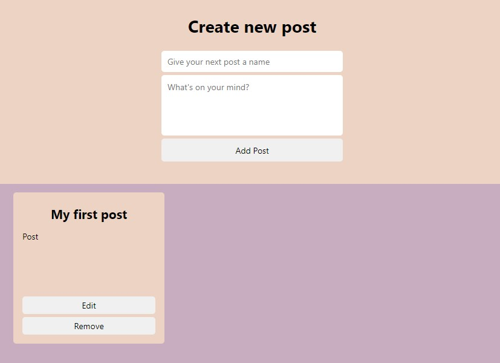
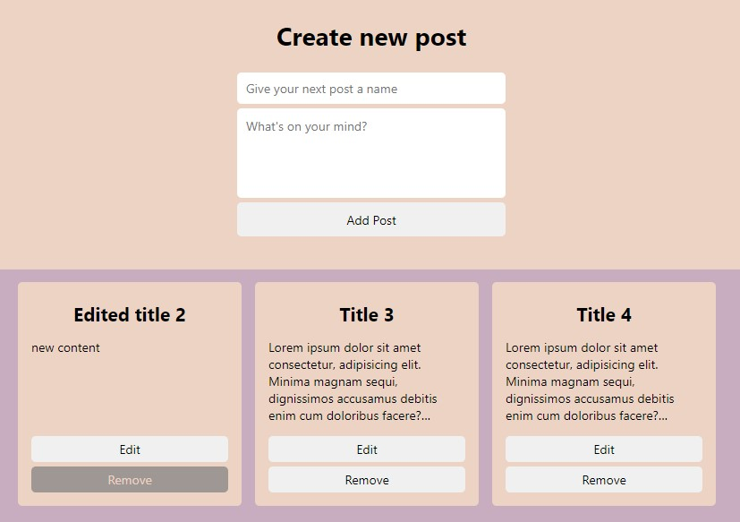
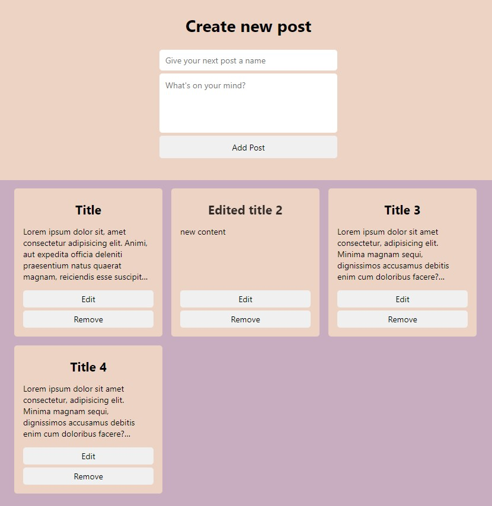
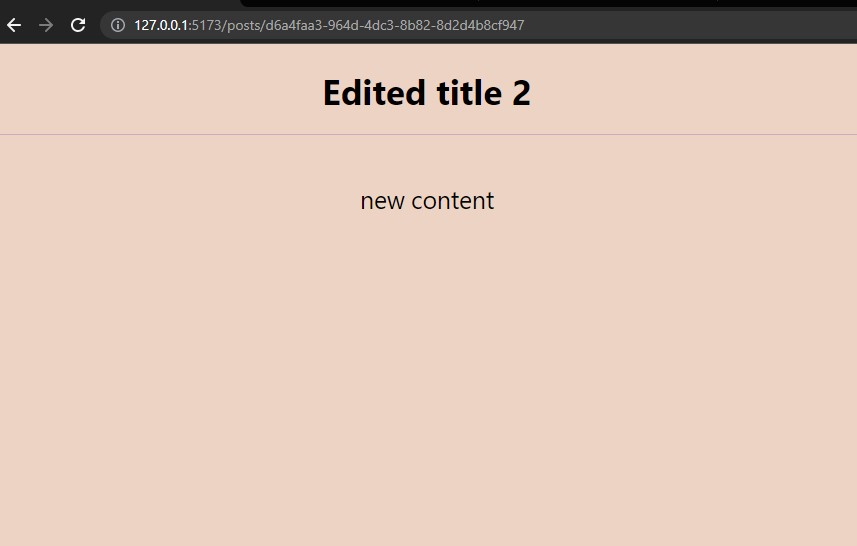

# Redux

### PREWORK:
`npm create vite@latest`

`cd project-directory`

`npm install`

`npm install @reduxjs/toolkit react-redux`

`npm install react-router-dom`

Zainstaluj [Redux DevTools](https://chrome.google.com/webstore/detail/redux-devtools/lmhkpmbekcpmknklioeibfkpmmfibljd)

Przed przystąpieniem do wykonania ćwiczeń zastanów się nad potrzebnymi Ci narzędziami i strukturą projektu, tj.
- czy użyję styled-components czy CSS modules,
- jaką ustanowię strukturę projektu - foldery "components", "features" może coś jeszcze?
- jak zdefniuję layout?
itd.

## 1. Zadanie
- Oczyść wcześniej utworzony projekt ze zbędnych plików, nastepnie
- skonfiguruj `store` i 
- zdefiniuj reducer odpowiedzialny za dodawanie nowego posta `addPost`. 
- `posts` w `store` jest to tablica przetrzymująca obiekty `post` o następującym kształcie: 
```
{
   id: string,
   title: string,
   content: string,
}
```

\* Instrukcję jak skonfigurować store i zdefiniować reducer znajdziesz [tutaj](https://redux-toolkit.js.org/tutorials/quick-start)

Efekt finalny powinien udostępniać funkcjonalość reprezentowaną poniższym zrzutem ekranu:



## 2. Zadanie
- Dodaj reducer umożliwiający usuwanie wcześniej utworzonych postów.

Efekt finalny powinien udostępniać funkcjonalość reprezentowaną poniższym zrzutem ekranu:


## 3. Zadanie
- Dodaj reducer umożliwiający edycję wcześniej utworzonych postów.

Efekt finalny powinien udostępniać funkcjonalość reprezentowaną poniższymi zrzutami ekranu:



# 4. Zadanie
- Skonfiguruj routing dla projektu,
- Zdefniuj komponent `Post`, który będzie się znajdował pod ścieżką `posts/:postId`,
- Zdefniuj tytuł pojedynczej karty postu jako odnośnik do ścieżki `posts/:postId`,
- Użyj hooka `useParams()` do wyciągnięcia `id` posta 
- Uzyj hooka `useSelector()` do wyciągnięcia danych dotyczących posta o konkretnym `id` ze `store`.


Efekt finalny powinien udostępniać funkcjonalość reprezentowaną poniższym zrzutem ekranu:



\* Instrukcję jak to zrobić znajdziesz [tutaj](https://reactrouter.com/en/main/start/tutorial)