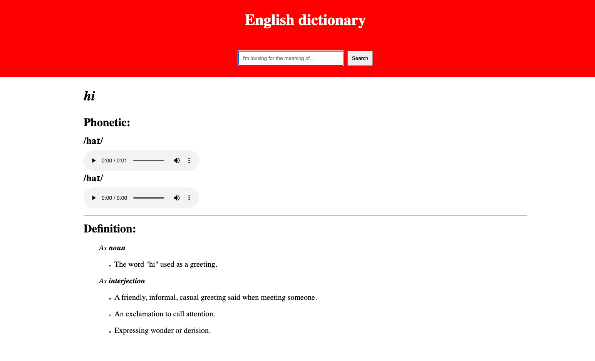

# Projekt React + TypeScript

Cześć 👋

Celem dzisiejszego projektu będzie zbudowanie aplikacji słownika języka angielskiego przy użyciu React i TypeScript.

Dokonamy tego korzystając z [Free Dictionary API](https://dictionaryapi.dev/).

Dodatkowe założenia obejmują:

- zastosowanie CSS modules do stylowania komponentów
- zastosowanie hooków do przetrzymywania stanu aplikacji
- zastosowanie biblioteki [React Hot Toast](https://react-hot-toast.com/) do informowania użytkownika o błędach

Ćwiczenie rozpoczniemy od próby wspólnego zaplanowania projektu.

Efekt finalny powinien przypominać funkcjonalność prezentowaną przez poniższy zrzut ekranu:

