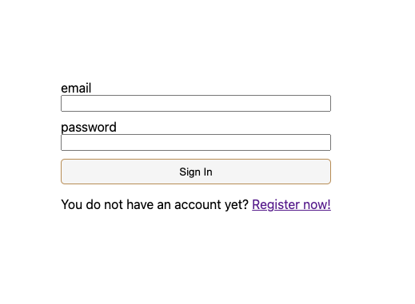
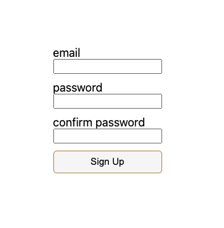
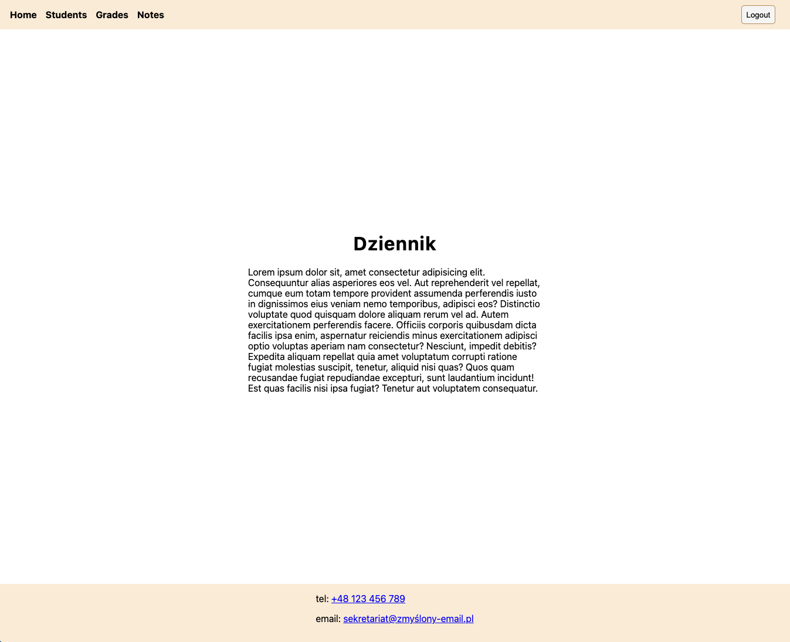
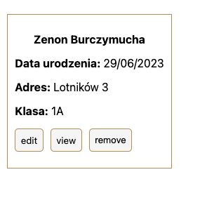
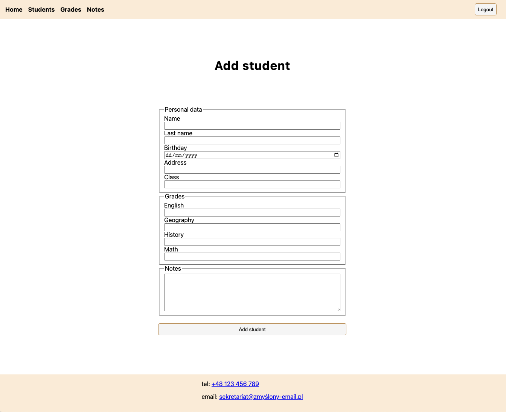
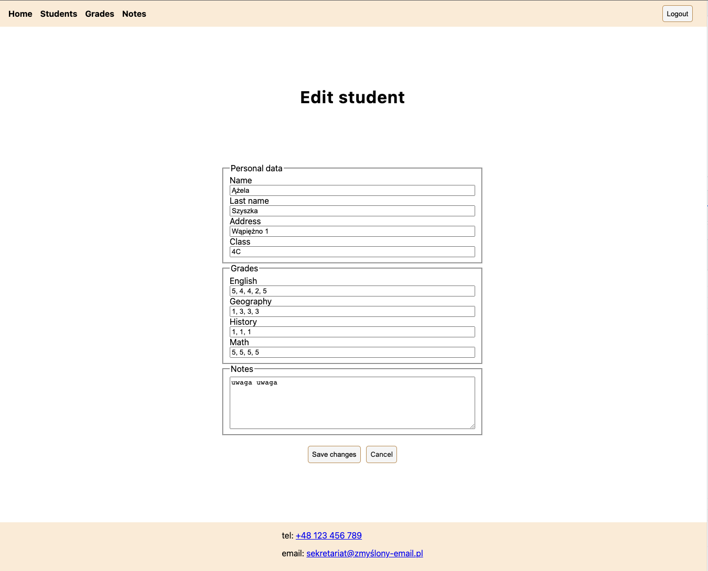
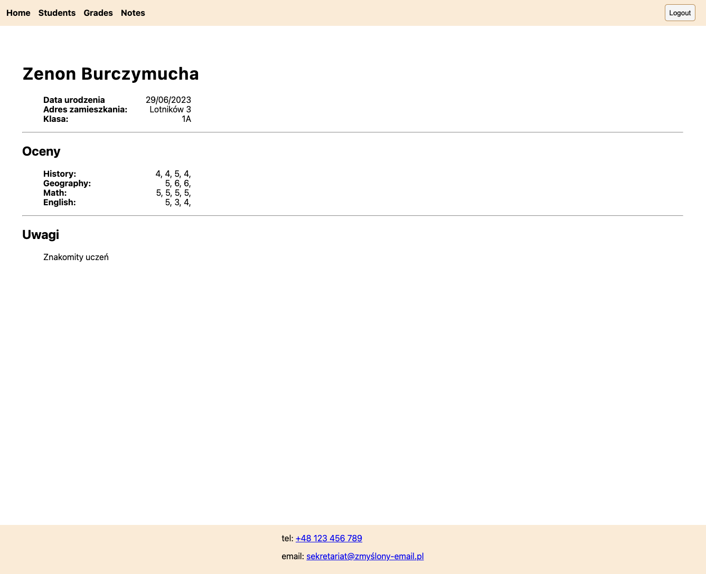

# Część 1.

## 1. Utwórz nowy projekt w firebase

Na bazie informacji z zajęć załóz projekt w [Firebase](https://firebase.google.com/).

## 2. Dodaj kolejcę z danymi o studentach

-  kolekcja students powinna zawierać listę studentów

   -  dane kazdego studenta powinny zawierać:
      -  imię,
      -  nazwisko,
      -  adres,
      -  data urodzenia,
      -  klasę (np. 1A, 2C, 3B itd),
      -  przedmioty z przypisanymi do nich ocenami (4-5 przedmiotów po 3 oceny),
      -  uwagi

-  Stwórz kilkoro takich studentów (6-8).

## 3. Stwórz pustą templatkę React i podłącz do niej firestore

-  `npm create vite@latest` lub `npx create-react-app students`,
-  wygeneruj konfigurację dla nowej aplikacji webowej w firebase i podłącz do niej aplikację w React.

## 4. Stwórz szkielet aplikacji w React

-  dodaj routing `npm i react-router-dom`,
-  stwórz szkielet zawierający zawsze widoczny `<Navbar />` i `<Footer />` pomiędzy którymi wyświetlana będzie treść strony,
-  skonfiguruj routing strony - chcemy aby znalazły się na niej takie podstrony:

   -  `/` dla Home
   -  `/students` dla Uczniów
   -  `/notes` dla Uwag
   -  `/grades` dla Ocen

-  Zbuduj komponenty `<NavBar />` i `<Footer />`. `<Navbar />` niech zawiera linki do wszystkich podstron i odsyłajkę do `<Home />`. Wykorzystaj w tym celu komponent `<Link />` z `react-router-dom`.

-  Zdefiniuj komponent `<Home />` - poinformujesz tam o zawartości podstron.

   ### Students

   -  Zdefniuj komponent `<Students />`, w którym wyciągniesz dane o studentach z firestore i wyświetlisz na ekranie następujące dane:
   -  imię i nazwisko,
   -  data urodzenia,
   -  adres,
   -  klasa,

   ### Grades

   -  Zdefiniuj komponent `<Grades />`, w którym wyciągniesz dane o studentach z firestore i wyświetlisz na ekranie następujące dane:
   -  imię i nazwisko,
   -  przedmioty z przypisanymi do nich ocenami

   *  Rozwaz podział komponentu `<Grades />` na osobne komponenty

   ### Notes

   -  Zdefiniuj komponent `<Notes />`, w którym wyciągniesz dane o studentach z firestore i wyświetlisz na ekranie nastepujące dane:
   -  imię i nazwisko,
   -  uwagi w dzienniku,

   *  Rozwaz podział komponentu `<Notes />` na osobne komponenty

   ## 5. NICE:

   -  wykorzystaj bibliotekę [react-hot-toast](https://react-hot-toast.com/) do wyświetlania komunikatów o błędach przy zasysaniu danych z firebase,

# Część 2.

## 1. Stwórz formularze rejestracji i logowania uzytkownika:

-  najpierw stwórz i ostyluj komponenty,
-  utwórz ściezki do tych komponentów wykorzystując `react-router-dom`,
-  skonfiguruj autoryzację uzytkownika po stronie firebase (email + password),
-  utwórz funkcje odpowiedzialne za rejestrację i logowanie uzytkownika

-  wykorzystaj bibliotekę `react-hot-toast` do informowania uzytkownika o błędzie i sukcesie w procesie rejestracji/logowania

## 2. Utwórz privateRoute:

-  wykorzystując informację o logowaniu uzytkownika spraw, by określone ściezki w routingu nie były dostępne dla niezalogowanych uzytkowników,
-  nalezy utworzyć komponent `<PrivateRoute />` (wygooglaj `<Outlet>` z `react-router-dom`),

## 3. Stylowanie i wylogowywanie:

-  ostyluj navbar i footer (dodaj telefon i email kontaktowy do footera),
-  dodaj przycisk logout i spraw by wylogowywał uzytkownika,
-  pod ściezką `/notes` w komponencie `<Notes />` wyświetl uwagi studentów z podpisem, których studentów jakie uwagi dotyczą,

## 4. Card:

-  stwórz i ostyluj komponent `<Card />` wyświetlający dane studenta pod ściezką `/students`
-  stwórz przycisk "remove" umozliwiający usunięcie studenta z bazy i zaimplementuj funkcjonalność usuwania
-  stwórz link ostylowany jak przycisk prowadzący pod ściezkę `/students/edit/:studentId`, pod którą zostanie zaimplementowany formularz edycji danych studenta
-  stwórz link "view" ostylowany jak przycisk prowadzący pod ściezkę `/students/data/:studentId`, pod którą zostanie zaimplementowany widok wszyskitch danych na temat danego studenta.

## 5. Dodawanie studenta:

-  w komponencie `<Students />` stwórz przycisk ostylowany jak link odsyłający pod ściezkę `/students/add`,
-  utwórz komponent `<AddStudent />` umozliwiający dodanie nowego studenta do bazy danych,
-  formularz musi zawierać wszystkie pola, które zawierają się w bazie danych,
-  zaimplementuj funkcjonalność dodawania studenta
-  powodzenie zapisu danych powinno zakończyć się odesłaniem uzytkownika z powrotem pod ściezkę `/students`

;

-  wykorzystaj bibliotekę `react-hot-toast` by informować o sukcesie lub błędzie przy próbie dodawania uzytkownika

## 6. Edycja danych studenta:

-  stwórz komponent `<EditStudent />`, do którego odsyła ściezka `/students/edit/:studentId`,
-  formularz w tym komponencie nie powinien zawierać pola umozliwiającego edycję daty urodzenia,
-  formularz domyślnie powinien wyświetlać aktualne dane studenta
-  zaimplementuj funkcjonalność edycji danych studenta,
-  powodzenie zapisu danych powinno zakończyć się odesłaniem uzytkownika z powrotem pod ściezkę `/students`

;

-  wykorzystaj bibliotekę `react-hot-toast` by informować o sukcesie lub błędzie przy próbie dodawania uzytkownika

## 7. Wyświetlanie danych studenta

-  stwórz komponent `<StudentData />`, który pod ściezką `/students/data/:studentId` będzie wyświetlał dane studenta np w następujący sposób:

;

-  do tego widoku odsyłać powinien przycisk "view" znajdujący się w komponencie `<Card />`;
